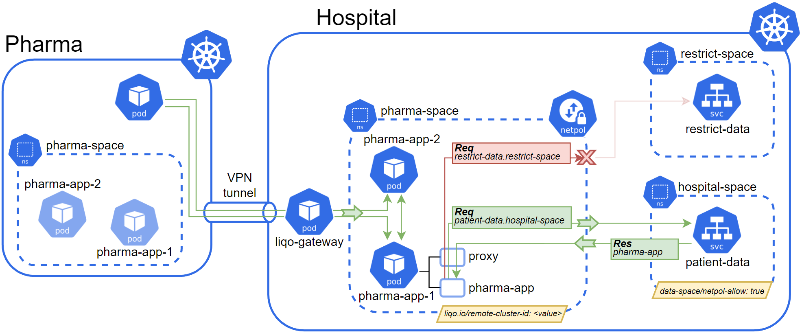

# Data Spacer

Kubernetes controller and webhook to use in conjunction with [Liqo](https://github.com/liqotech/liqo) for data spaces.

## Project structure

The **build** folder contains the Dockerfiles required to build the container images used in this project:

- **build/init-container** contains the Dockerfile for building and running the init container injected in the mutated pod;
- **build/webserver** and **build/app** contain each a Dockerfile for building and running an example Node.js app.

The **controllers** folder contains the controller's reconcile logic to reconcile Namespace resources.

The **deploy** folder contains the manifests required to deploy the project.

The **pkg** folder contains the webhook logic.

The **runs** folder contains the manifests required to deploy the example applications of the **build** folder.

## Main concepts

The main concepts are visualized in the following image:

The Foreign Cluster establishes a peering session with the Host Cluster, to which it offloads its _app-ns_ and so its _app_ pod. The _app-ns_ in the Host Cluster is reconciled by the namespace controller (_liqo.io/remote-cluster-id_) and is enriched by default with two Kubernetes resources:

- a ConfigMap that stores the proper Envoy Proxy configuration required to mutate the pod and inject a proxy sidecar (setting _data-space/apply-webhook=false_ will prevent this);
- a NetworkPolicy for controlling egress and ingress traffic from the mutated pod (setting _data-space/apply-netpol=false_ will prevent this).

## How it works

The controller's reconcile logic watches and handles Namespace resources that are labeled with _liqo.io/remote-cluster-id_. These namespaces are enriched by default with:

- a ConfigMap resource that will contain the Envoy Proxy configuration to be used by the webhook to inject the proxy sidecar into all pods hosted on the same namespace;
- a NetworkPolicy resource that only allows egress destinations and ingress sources labeled with _data-space/netpol-allow=true_.

However, it is possible to prevent the creation of one or both of those two resources by respectively setting the following labels on Namespace resources:

- _data-space/apply-webhook=false_. This also prevents pods executed in such namespaces from being mutated by the mutating webhook.
- _data-space/apply-netpol=false_

The **build/webserver** Node.js application exemplifies a web server exposing a set of data under two endpoints, _/products_ and _/products/:id_.
The **build/app** Node.js application exemplifies a client that makes HTTP requests. To make the interaction easier, this application also works as a web server by exposing an endpoint under _/custom?url_ that lets users choose the endpoint to make the HTTP request to. ALternatively, the _/data_ endpoint performs an HTTP request to the other web server's _/products_ endpoint.

## License

Copyright 2022.

Licensed under the Apache License, Version 2.0 (the "License");
you may not use this file except in compliance with the License.
You may obtain a copy of the License at

    http://www.apache.org/licenses/LICENSE-2.0

Unless required by applicable law or agreed to in writing, software
distributed under the License is distributed on an "AS IS" BASIS,
WITHOUT WARRANTIES OR CONDITIONS OF ANY KIND, either express or implied.
See the License for the specific language governing permissions and
limitations under the License.
